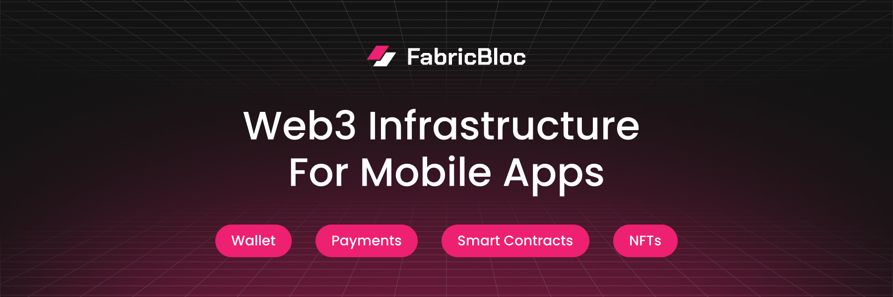

# FabricBloc

**Web3 infrastructure for mobile apps.**

Wallets, payments, and smart contracts — embedded directly into your app. No browser extensions. No seed phrases. No gas fees for users. Non-custodial by default — users own their keys.

[](https://docs.fabricbloc.com) [](https://www.npmjs.com/org/fabricbloc) [](https://github.com/FabricBloc/FabricKit) [](https://github.com/FabricBloc/FabricKit/blob/main/LICENSE)

---

## What We Build

```
Your App
  └── FabricKit / fabricbloc-ts
        ├── Embedded Wallets     → non-custodial, created in-app
        ├── Payments             → USDC send/receive, gas-sponsored
        ├── Smart Contracts      → deploy & interact via API
        ├── NFTs & Tokens        → ERC-721, ERC-1155, ERC-20 factories
        └── Transaction Engine   → batching, sponsorship, orchestration
```

## Chains

[](https://base.org) [](https://ethereum.org) [](https://polygon.technology)

EVM-first. We build on Ethereum and extend across L2s.

---

## SDKs

| Package | Platform | Status |
|---------|----------|--------|
| [`FabricKit`](https://github.com/FabricBloc/FabricKit) | Swift — iOS / macOS | Active |
| [`fabricbloc-ts`](https://github.com/FabricBloc/fabricbloc-ts) | TypeScript / Node.js | Active |
| [`fabricbloc-python`](https://github.com/FabricBloc/fabricbloc-python) | Python | Active |
| [`fabricbloc-mcp`](https://github.com/FabricBloc/fabricbloc-mcp) | MCP — AI agent access | Active |
| Android SDK | Kotlin | Coming Soon |

```typescript
import { FabricBlocSDK } from "@fabricbloc/sdk";

const sdk = new FabricBlocSDK({ apiKey: process.env.FABRICBLOC_API_KEY });

// Create a non-custodial wallet — no seed phrases, no popups
const wallet = await sdk.mpc.createWallet({
  consumerId: "user_123",
  chains: ["base", "ethereum"],
});
console.log(wallet.address); // 0x...

// Send USDC — gas sponsored, user pays nothing
await sdk.payments.send({
  from: wallet.id,
  to: "0xRecipient",
  amount: "10.00",
  currency: "USDC",
});
```

---

## Getting Started

```bash
# TypeScript / Node.js
npm install @fabricbloc/sdk

# Python
pip install fabricbloc

# Swift — Xcode → File → Add Package Dependencies
# https://github.com/FabricBloc/FabricKit
```

---

## Developer Tools

| Tool | Purpose |
|------|---------|
| [`fabricbloc-mcp`](https://github.com/FabricBloc/fabricbloc-mcp) | MCP server — AI agents interact with FabricBloc APIs |
| [`fabricbloc-docs`](https://docs.fabricbloc.com) | API reference and guides |

---

## Links

**Docs** — [docs.fabricbloc.com](https://docs.fabricbloc.com) | **API** — [docs.fabricbloc.com/api](https://docs.fabricbloc.com/api) | **Website** — [fabricbloc.com](https://fabricbloc.com)

---

Built by [BlocLabs](https://bloclabs.com) — blockchain engineering for companies that ship.
